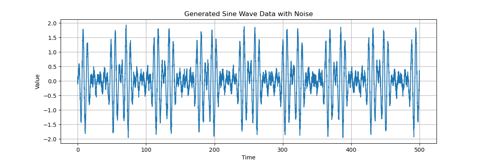

# LSTM Time Series Forecasting Demo

This project demonstrates a simple implementation of an LSTM (Long Short-Term Memory) neural network for time series forecasting using TensorFlow/Keras. This was created as part of demonstrating skills for a job application.

## Goal

The goal is to predict the next value in a synthetic time series (a sine wave with added noise) based on a sequence of previous values (looking back 50 steps).

## Skills Demonstrated

*   **Python:** Core programming language.
*   **TensorFlow/Keras:** Building, training, and evaluating the deep learning model.
*   **LSTM Networks:** Implementing recurrent neural networks suitable for sequential data.
*   **Data Preprocessing:** Using Scikit-learn for scaling data (MinMaxScaler) and NumPy for creating sequential data structures.
*   **Pandas/NumPy:** Data manipulation and numerical operations.
*   **Matplotlib:** Visualizing data and results.
*   **Model Evaluation:** Using RMSE (Root Mean Squared Error).
*   **Git/GitHub:** Version control and project sharing.

## How it Works (Briefly)

1.  **Data Generation:** A synthetic sine wave with noise is generated.
2.  **Preprocessing:** Data is scaled (0-1) and formatted into sequences (input=50 steps, output=1 step).
3.  **Model:** A Keras Sequential model with LSTM and Dropout layers is built.
4.  **Training:** The model is trained on the sequences, minimizing mean squared error.
5.  **Evaluation:** Predictions are made on unseen test data and compared to actual values using RMSE.

## Results

**Generated Data:**


**Training Loss:**


**Predictions vs Actual:**


## How to Run

1.  Ensure you have Python (ideally 3.11 for TensorFlow compatibility used here) and Conda installed.
2.  Clone the repository.
3.  Create and activate a Conda environment:
    ```bash
    conda create --name tf_project python=3.11
    conda activate tf_project
    ```
4.  Install dependencies (use pip for TensorFlow if conda install fails):
    ```bash
    # Recommended:
    pip install tensorflow pandas numpy scikit-learn matplotlib
    # Or try conda first:
    # conda install -c conda-forge tensorflow pandas numpy scikit-learn matplotlib
    ```
5.  Run the script:
    ```bash
    python lstm_timeseries.py
    ```